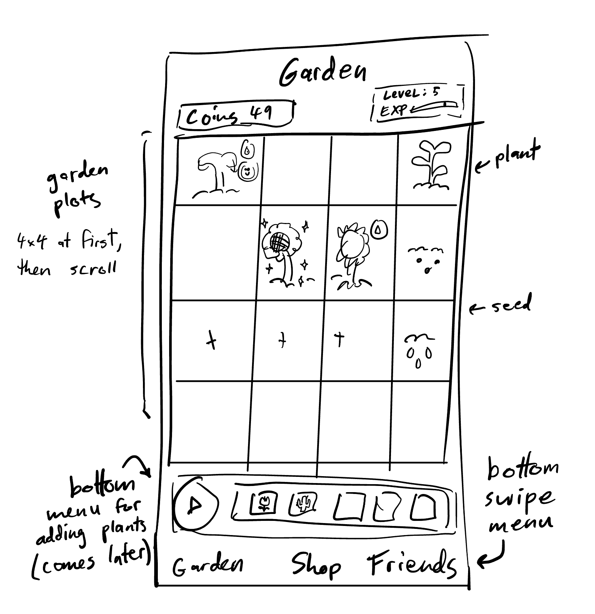
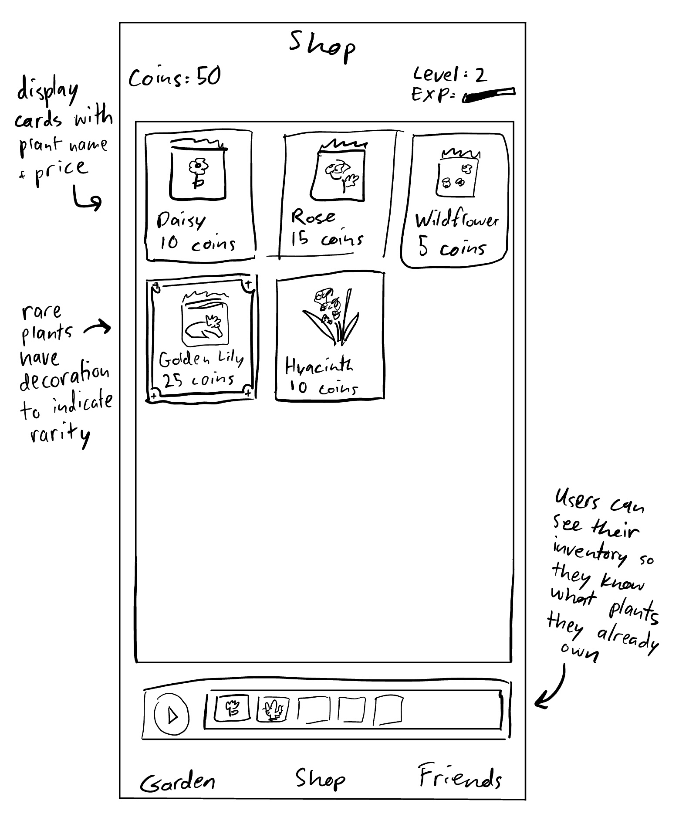
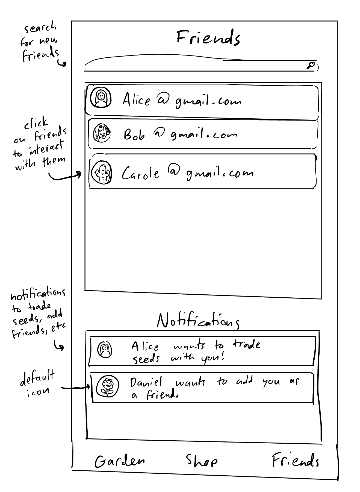

# System Architecture Overview
The app will use Firebase Auth. The login and sign up screens will handle the user authentication flows. The app will also use Firebase Datastore to track a user's friends, garden plants, and inventory.

# Team Decisions
The first major team decision we had made was to use React-Native coupled with Expo instead of Unity to develop our game (occurred after [Standup 3](https://github.com/ucsb-cs184-f24/team06/blob/main/team/sprint01/sec02.md)). This allowed us to work on different operating systems and deploy to iOS devices. 

The next decision we had made was what our app layout should look like, and what data structures to create for our application. Since we wanted to make a satisfying idle game that allowed users to buy plants and trade them with other users, we decided to divide the app into three pages, with a plot, seed, and plant data structure to work on ([Standup 6](https://github.com/ucsb-cs184-f24/team06/blob/main/team/sprint03/lec06.md)). 

Another major decision our team made was to decide on using Firebase to store all user data (plants, seeds, friends) and to handle authentication ([Standup 9](https://github.com/ucsb-cs184-f24/team06/blob/main/team/sprint04/lec07.md)). We made this decision because we found Firebase easy to work with during Homework 2, and we could reuse the login functionality we wrote for Homework 2 for our app. 

After our code freeze, we made the team decision to use a pixel graphics art style for our application ([Lecture 13](https://github.com/ucsb-cs184-f24/team06/blob/main/team/sprint07/lecture13.md)). We chose to use a pixel art style after experimenting with 3D models for Homework 3, and deciding that they were too computationally expensive to use and did not suit the cozy feeling we wanted our game to give the user. 

After implementing Firebase functionality, we made the team decision to change our starting data structures to ones that were easier to store and update in Firebase ([Lecture 15](https://github.com/ucsb-cs184-f24/team06/blob/main/team/sprint08/lecture15.md)). We decreased redundancy by storing shop and inventory items as Seed objects, and plants in the garden plot as Plant objects. This let us add new sprites to Plant objects in the garden, and keep track of what sprites should display based on Plant growth.

Our final major team decision was choosing how to implement trade functionality ([Lecture 17](https://github.com/ucsb-cs184-f24/team06/blob/main/team/sprint10/lec17.md)). At the time of our standup, users could exchange plants with their friends, but their friends did not have an option to veto the trade. Given the time we had remaining for the course, we initially made the hard decision to scrap the trading feature and replace it with a plant gifting feature. However, we were able to add functionality where users could accept or reject incoming trades before the deadline, so we changed the language in the trade modals to "trade request" instead of "trade" to indicate that the other user needed to approve the request to trade plants. 

# User Experience and Task Flow

When users first launch the app, they're presented with a login screen where they have two options: sign in with existing credentials or create a new account through the sign-up process. After successful authentication, users land on the main garden page, which serves as the central hub of the application. In their garden, users can interact with their plants in several ways: they can select plants from their inventory and place them in available garden plots, water their existing plants to maintain their health, or use a shovel to remove plants if needed. From this main garden view, users can navigate to two other key features. The shop page allows users to browse and purchase new plant seeds, which are automatically added to their inventory for future planting. Additionally, users can access the friends page, where they can view their existing friends list, add new friends to their network, and visit their friends' gardens to see their progress. This design creates a seamless flow between gardening, shopping, and social interactions, with the garden page serving as the primary return point for all activities.

# User Experience (UX) Considerations
We wanted our game to be accessible to casual gamers, not targeted towards intense players that wanted to maximize their plant growth or number of coins. Thus, we made our interface very straightforward, with only a small number of screens: the player’s garden, shop and list of friends. We pushed the inventory on the garden page towards the bottom of the screen so that players could use one hand to plant new seeds, harvest seeds and dig up unwanted plants. This way, users could play our app one-handed in bed, on a crowded bus, or whenever they had a few moments to spare between busy activities. We also added animation feedback when a user interacted with a garden plot to encourage them to customize their garden. Because we were developing an idle game, we added long growth times for our plants that would take days to properly develop, and added lofi music to encourage users to slow down when playing them app. However, we still wanted users to check the app to see the development of their plants, so we added the growth boost and free seed features to encourage checking the app on an occasional basis.

# Stages of Design
We started our design process with simple sketches of the three pages that we wnated for our app: the garden, shop and friends page.

  

# Difficulties Encountered
One difficulty we encountered was adding Firebase functionality to the data structures we used to store our plots, plants, seeds and inventory. Rather than adding this functionality to the data structures that we had already written, we decided to create new data structures that updated directly to Firebase without storing changes locally. This caused some difficulty when adding new features to the game, as certain functionalities were still based on data structures that were not connected to Firebase. After meeting to discuss which data structures to use in future pull requests, we updated all game screens to use the new data structures, and deleted the old code in a future commit. 

Another difficulty we encountered was displaying graphics. Our images were getting pixelated when scaling them up to a size that we found appropriate. The issue is that react-native's Image component has a feature that applys anti-aliasing to images so that they appear less blurry. However, since our images are pixelated art we didn't want them to be blurry but maintain the sharp edges that give the pixel art its feel. Thus, we used a library called **react-native-svg** that converts images to SVG file objects that do not anti-alias when scaled because they use points and lines to render images. 

# External Resources Used
- react-native-svg
- expo
  - expo-router
  - expo-sensors
  - expo-image
- react-native-async-storage 
- react-native-sound
- firebase
- react-native-gesture-handler
- lodash

# Evaluation/Testing Results (optional)

#### **GardenScreen Testing**
The testing for `GardenScreen` focused on verifying user interactions within the garden interface. Tests included:

1. **Component Rendering**
   - Verified that the components such as `GardenGrid`, `PlayerInventory`, and `GardenTools` render correctly.
   - Confirmed the presence of interactive elements like buttons for planting, harvesting, selecting seeds, and tools.

2. **State Management**
   - Ensured that selecting a seed from the inventory correctly updates the `selectedItem` state.
   - Confirmed that planting a seed triggers the appropriate updates, such as removing the seed from inventory.
   - Tested the harvesting process to validate that the harvested seed is added back to the inventory.

#### **ShopScreen Testing**
The testing for `ShopScreen` evaluated the functionality of the in-game shop system. Tests included:

1. **Modal Behavior**
   - Verified that pressing a shop item opens the modal with the correct information.

2. **Purchase Flow**
   - Tested the "Buy Now" button to ensure it triggers an alert on successful purchase.
   - Verified that the alert displays the correct item name and purchase confirmation message.

3. **Shop Items**
   - Mocked the `Shop` module to simulate available shop items and their prices.
   - Ensured that items display their names and prices correctly on the screen.
