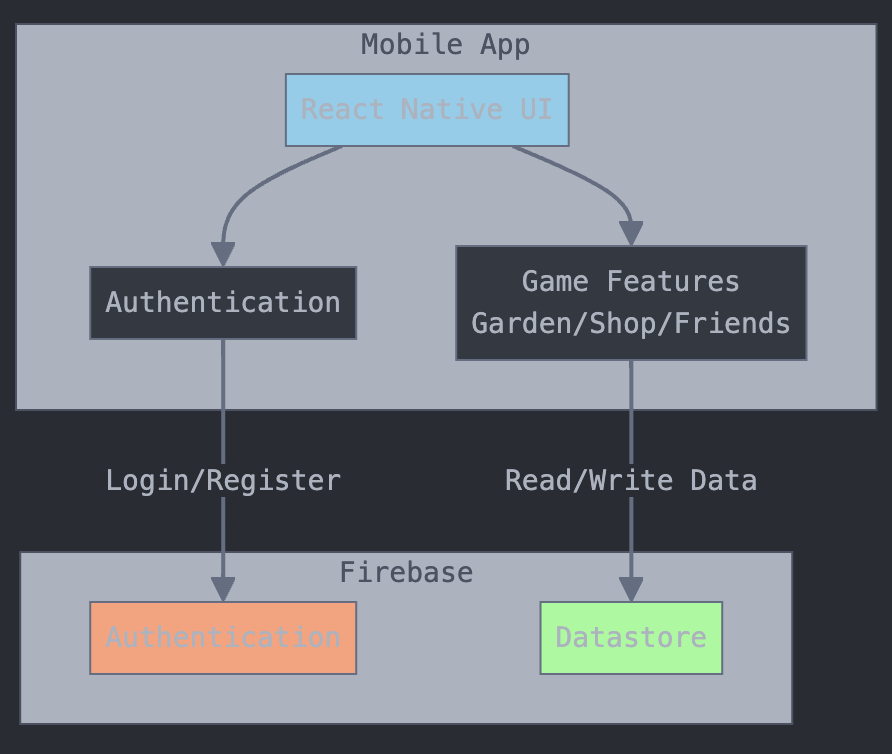

# System Architecture Overview
The app will use Firebase Auth. The login and sign up screens will handle the user authentication flows. The app will also use Firebase Datastore to track a user's friends, garden plants, and inventory.

# Team Decisions
The first major team decision we had made was to use React-Native coupled with Expo. This allowed us to work on different operating systems and deploy to iOS devices. The next decision we had made was to figure out how we wanted to build the game and what features were important to us. We wanted to make a satisfying idle game that allowed users to buy plants and trade them with other users. This would create a fun, chill, and social game that users will love to come back to play every often. Another major decision my team made was to decide on using Firebase to store all user data (plants, seeds, friends) and to handle authentication.

# User Experience and Task Flow

When users first launch the app, they're presented with a login screen where they have two options: sign in with existing credentials or create a new account through the sign-up process. After successful authentication, users land on the main garden page, which serves as the central hub of the application. In their garden, users can interact with their plants in several ways: they can select plants from their inventory and place them in available garden plots, water their existing plants to maintain their health, or use a shovel to remove plants if needed. From this main garden view, users can navigate to two other key features. The shop page allows users to browse and purchase new plant seeds, which are automatically added to their inventory for future planting. Additionally, users can access the friends page, where they can view their existing friends list, add new friends to their network, and visit their friends' gardens to see their progress. This design creates a seamless flow between gardening, shopping, and social interactions, with the garden page serving as the primary return point for all activities.

# User Experience (UX) Considerations
We wanted our game to be accessible to casual gamers, not targeted towards intense players that wanted to maximize their plant growth or number of coins. Thus, we made our interface very straightforward, with only a small number of screens: the player’s garden, shop and list of friends. We pushed the inventory on the garden page towards the bottom of the screen so that players could use one hand to plant new seeds, harvest seeds and dig up unwanted plants. This way, users could play our app one-handed in bed, on a crowded bus, or whenever they had a few moments to spare between busy activities. We also added animation feedback when a user interacted with a garden plot to encourage them to customize their garden. Because we were developing an idle game, we added long growth times for our plants that would take days to properly develop, and added lofi music to encourage users to slow down when playing them app. However, we still wanted users to check the app to see the development of their plants, so we added the growth boost and free seed features to encourage checking the app on an occasional basis.
