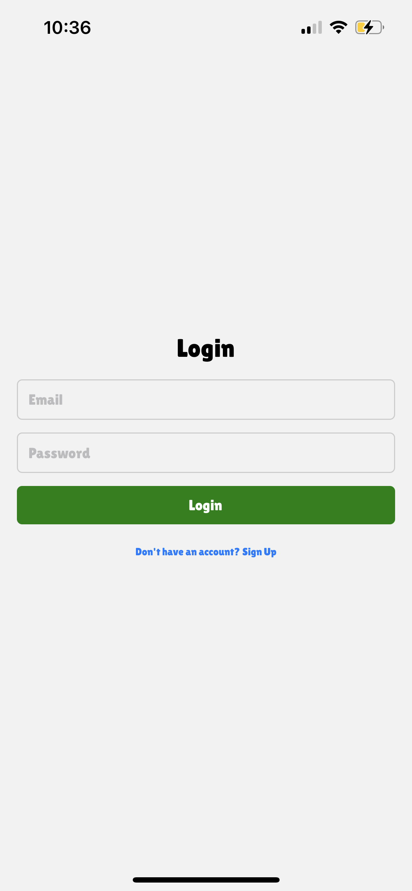
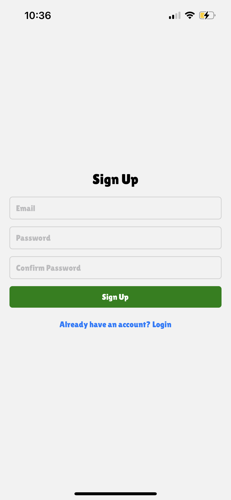
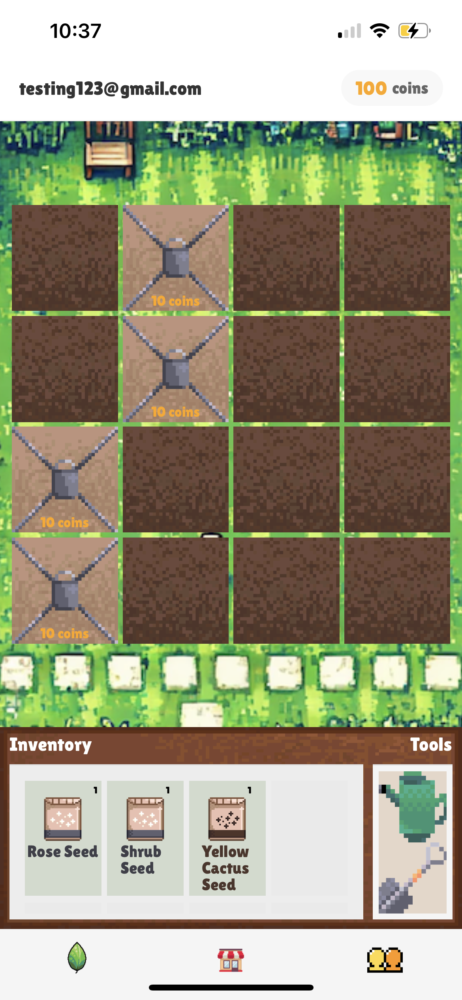
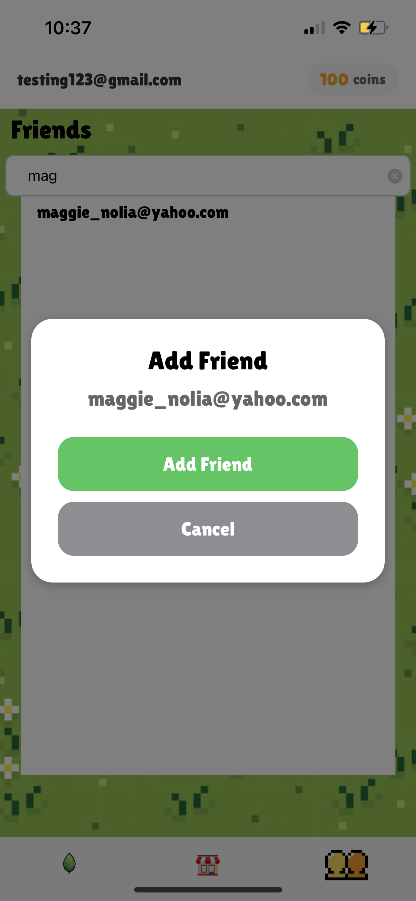
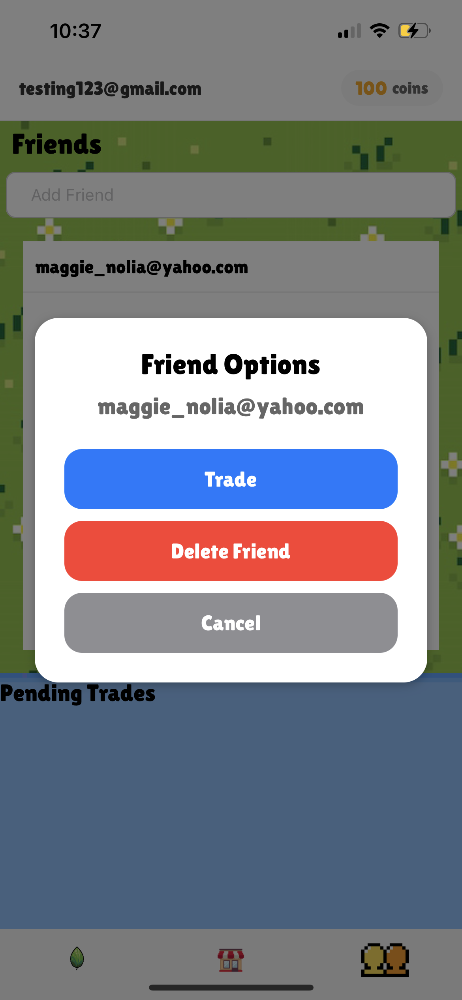
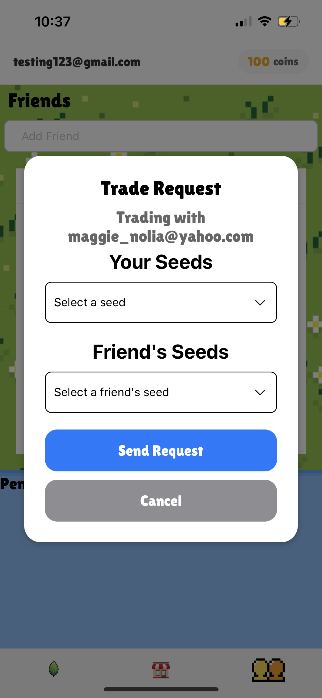

# Team06

## Plant Crossing

### Project Description
Plant Crossing is an idle plant game where players can buy seeds, grown plants, and trade with friends to build the best garden possbile.

### Target Audience
Casual gamers who enjoy relaxing/idle games and are eager to connect with others and build community through simple fun. For example, college students.

## Installing Plant Crossing
### Prerequisites 
- **Expo Go App**: Download from the App or Google Play Store, or through https://expo.dev/go.
- **npm (version 10.9.0)**: Can be downloaded from Node.js: https://nodejs.org/en. 

### Installation
- Clone the GitHub repository.
``` git clone https://github.com/ucsb-cs184-f24/team06.git ```
- Enter the project directory.
``` cd plant-crossing ```
- Install dependencies.
``` npm install ```
- Start the development server with Expo Go.
``` npx expo start --tunnel ```
- Scan the QR code to access Plant Crossing.

## Getting Started
### Logging In
When you open the app, you'll be prompted to log in. If you don't have an account, you can register with an email and password. Once you have registered or logged in, you will allowed in to the main pges.

 

### Making Your First Purchase
Using the bottom navigating menu, select the middle icon to go to the shop page. Here you can see a list of plants currently on sale for coins. You can spend coins to buy seeds for these plants to then grow yourself. Don't forget to also grab your daily free randomized seed!

 

### Plant Your Seed
Once you've purchased a seed, use the navigation menu's left button to see your garden page. Here you can select your new seed from your inventory and tap an open garden plot to plant it. As you collect coins you can unlock more and more space for your plants. 



### Tending To Your Plants
All that's left to do now is watering your plant- select the watering can then tap on a plant to water it. If plants are watered, they will grow even faster. If you need to remove a plant, use the shovel next to the watering can and you'll get some coins back.

### Making Friends
If you'd like to connect with a friend, navigate to the friends page with the right button in the navigation panel. Here you can see a list of the friends you've connected with so far. To add a friend to your list, type in their email and select them. To remove them, tap their email in the friends list and select "delete friend".

 

### Trading with Friends
At the bottom of the friends screen you'll see a list of pending trades, which you can tap on to either accept or reject. You can propose a trade by selecting a friend from your friend list, selecting "trade", and choosing the plants involved in the trade.


